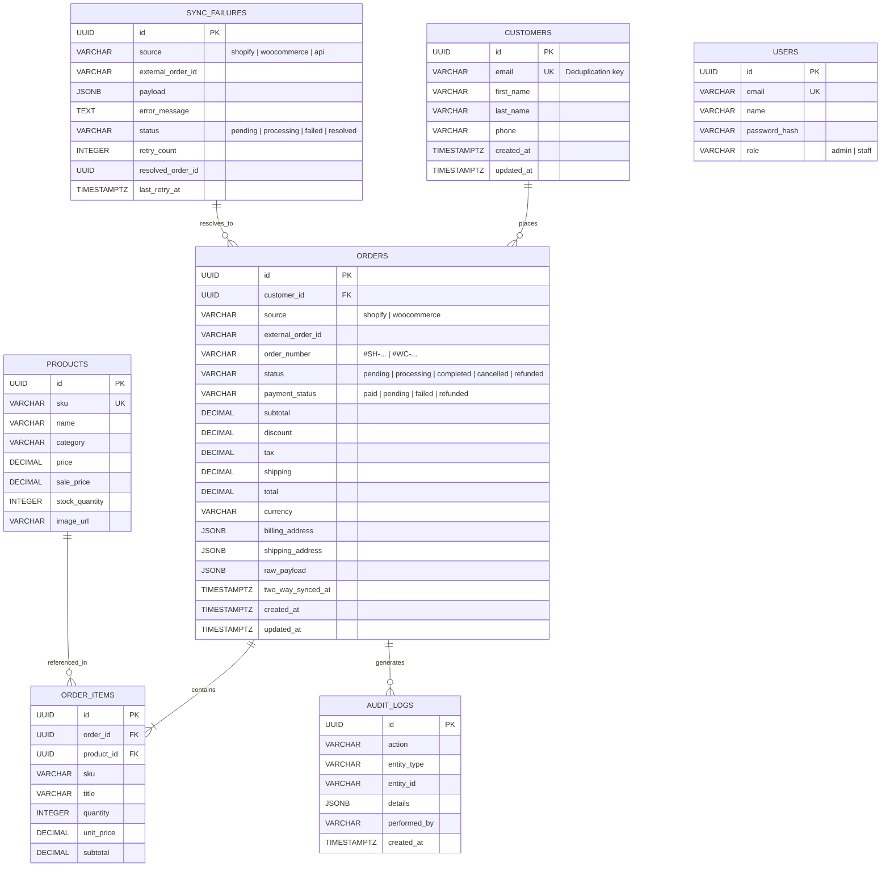

# Multi-Store Central Order Management System (CRM)
## Architecture, ERD & Technical Specification

This document provides a comprehensive technical overview of the Central CRM application designed to act as the single source of truth for orders originating from **Shopify** and **WooCommerce** storefronts.

---

## 1. Relational Database Design & Entity Relationship Diagram (ERD)

The database enforces strict referential integrity, composite unique constraints for idempotency, and indexes optimized for filtering and pagination across 10,000+ products and high order volumes.



### Relational Constraints & Idempotency Key
- `orders.UNIQUE(source, external_order_id)`: Guarantees that neither Shopify nor WooCommerce can cause duplicate order records upon webhook retries.
- `customers.UNIQUE(email)`: Ensures that customer profiles are automatically consolidated across stores.

---

## 2. Webhook Ingestion & Security Architecture

### Ingestion Pipeline
```
Storefront Webhook (Shopify / WooCommerce)
  │
  ▼ [1. Raw Buffer Body Capture]
  │
  ▼ [2. HMAC SHA-256 Signature Verification]
  ├── (Invalid) ──► Log 401 & Capture in Dead Letter Queue (DLQ)
  │
  ▼ [3. Event ID Nonce / Replay Check]
  │
  ▼ [4. Payload Normalization & Schema Validation]
  ├── (Malformed) ──► Log 422 & Capture in Dead Letter Queue (DLQ)
  │
  ▼ [5. Customer Deduplication Lookup (by Email)]
  │
  ▼ [6. Atomic Database Transaction]
  │     ├── Idempotency Check on (source, external_order_id)
  │     ├── Insert/Update Order
  │     ├── Insert Line Items & Inventory Allocation
  │     └── Log Audit Record
  │
  ▼ [7. Real-Time Broadcast (SSE)]
  │
  ▼ [8. Two-Way Store Status Dispatch (Optional / Configurable)]
```

### Webhook Security & Verification
1. **Shopify HMAC SHA-256**:
   - Header: `X-Shopify-Hmac-Sha256`
   - Verification: `crypto.createHmac('sha256', SHOPIFY_SECRET).update(rawBody).digest('base64')`
   - Constant-time verification with `crypto.timingSafeEqual` prevents side-channel timing attacks.
2. **WooCommerce Webhook Signature**:
   - Header: `X-WC-Webhook-Signature`
   - Verification: `crypto.createHmac('sha256', WOOCOMMERCE_SECRET).update(rawBody).digest('base64')`
3. **Sliding-Window Rate Limiting**:
   - Limits ingress per IP/source to 200 requests/minute with standard `X-RateLimit-*` and `Retry-After` headers.

---

## 3. Customer Deduplication & Conflict Resolution

### Deduplication Rule:
- Primary key: Lowercased, sanitized Email (`sanitizeEmail()`).
- E-commerce rationale: Email is universally required for receipts and tracking across both Shopify and WooCommerce checkouts.
- When an order arrives from either store:
  1. The system queries `SELECT * FROM customers WHERE email = ?`.
  2. If found, the order links to that `customer_id`, and any missing contact details (first name, last name, phone) are enriched.
  3. If not found, a new customer record is created.
  4. The customer profile provides a consolidated view of lifetime spend, average order value (AOV), and chronological orders from all stores.

---

## 4. Failure Handling & Dead Letter Queue (DLQ)

When a store webhook encounters issues (e.g. invalid formatting, schema mismatch, or temporary errors):
1. The error boundary catches the exception and saves the event to the `sync_failures` table with:
   - `source`: Store name (`shopify` / `woocommerce`).
   - `payload`: Full uncorrupted raw JSON.
   - `error_message`: Precise validation error.
   - `status`: `pending`.
2. Operators inspect the failed payload in the **Dead Letter Queue** UI.
3. The UI allows in-place JSON payload editing and 1-click **Retry Synchronization**.
4. Duplicate order protection ensures retrying does not create duplicate orders.

---

## 5. Scaling Architecture: 10,000+ Products & High Order Volumes

To scale the system to 10,000+ products and 100,000+ daily orders:

1. **Database Indexing & Query Execution**:
   - Indexed composite keys on `(customer_id, created_at)`, `(source, status)`, `(category, price)`, and `(sku)`.
   - Index scans avoid full table scans, keeping query latency under 5ms even with tens of thousands of rows.

2. **API Pagination & Virtualized Windowing**:
   - Catalog and order endpoints enforce cursor/offset pagination (`limit=25`, `page=N`).
   - Frontend leverages lightweight rendering and avoids rendering offscreen nodes.

3. **High-Throughput Asynchronous Worker Architecture**:
   - High-volume ingestion can decouple HTTP ingress from database writes using an in-memory or Redis queue (BullMQ).
   - Ingestion endpoint immediately returns `202 Accepted` after signature check, queueing the payload for worker processing.

4. **Multi-Region & Caching Layer**:
   - Redis or CDN edge caching for product catalogue lookups with TTL-based cache invalidation upon inventory adjustment.
   - Read replicas for customer analytics and dashboard queries.

---

## 6. Default Credentials

- **Admin Account**: `admin@crm.local` / `admin123` (Full access, DLQ retries, store simulation, customer merge)
- **Staff Account**: `staff@crm.local` / `staff123` (Order viewing, status updating, catalog browsing)
